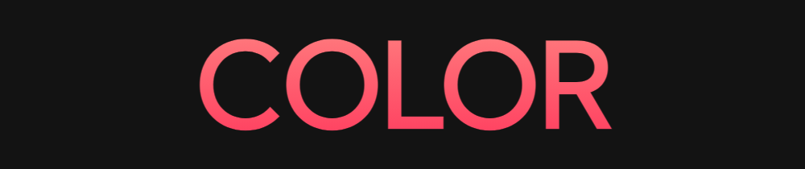

# 🖌️ Responsive Beginner JS Project with Smooth Scroll

This tutorial is from the Brian Design channel, you can see more of his content <a href="https://www.youtube.com/channel/UCsKsymTY_4BYR-wytLjex7A">here</a>

YouTube tutorial link <a href="https://www.youtube.com/watch?v=3-2Pj5hxwrw">here</a>

## Tools and Languages

* <a href="https://code.visualstudio.com/download">VSCode</a>
* <a href="https://developer.mozilla.org/pt-BR/docs/Web/HTML">HTML</a>
* <a href="https://developer.mozilla.org/pt-BR/docs/Web/CSS">CSS</a>
* <a href="https://developer.mozilla.org/pt-BR/docs/Web/JavaScript">JavaScript</a>
